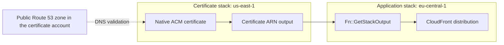

# ACM certificates

`DnsValidatedCertificateV2` creates a DNS-validated public ACM certificate in a chosen AWS region. It uses native CloudFormation resources and can place the certificate in a separate stack, including `us-east-1` for CloudFront applications deployed from another region. Import it from `@open-constructs/aws-cdk/aws-certificatemanager`; the module is maintained and released as part of the Open Constructs Library.

## Requirements

Use Node.js 22 or newer, `aws-cdk-lib` 2.268.0 or newer, and `constructs` 10.8.1 or newer. The library provides JavaScript/TypeScript and Python bindings. Install the JavaScript package with its peers:

```bash
npm install @open-constructs/aws-cdk 'aws-cdk-lib@^2.268.0' 'constructs@^10.8.1'
```

DNS validation requires a publicly delegated Route 53 zone in the certificate account. The requested certificate region must be concrete. Separate-stack placement also requires a concrete containing-stack region and concrete hosted-zone IDs. Use an existing zone imported by ID or attributes, or an explicit application lookup. The construct does not perform lookups or SDK calls during synthesis.

## CloudFront from another region

CloudFront requires its viewer certificate in [`us-east-1`](https://docs.aws.amazon.com/AmazonCloudFront/latest/DeveloperGuide/cnames-and-https-requirements.html). An explicit owner stack makes certificate lifecycle management straightforward:

```typescript
import { App, Stack } from 'aws-cdk-lib';
import { DnsValidatedCertificateV2 } from '@open-constructs/aws-cdk/aws-certificatemanager';
import { Distribution } from 'aws-cdk-lib/aws-cloudfront';
import { HttpOrigin } from 'aws-cdk-lib/aws-cloudfront-origins';
import { HostedZone } from 'aws-cdk-lib/aws-route53';

const app = new App();
const account = process.env.CDK_DEFAULT_ACCOUNT;
const certificates = new Stack(app, 'Certificates', {
  env: { account, region: 'us-east-1' },
});
const application = new Stack(app, 'Application', {
  env: { account, region: 'eu-central-1' },
});
const zone = HostedZone.fromHostedZoneAttributes(certificates, 'Zone', {
  hostedZoneId: 'Z1234567890',
  zoneName: 'example.com',
});
const certificate = new DnsValidatedCertificateV2(application, 'Certificate', {
  domainName: 'www.example.com',
  hostedZone: zone,
  certificateStack: certificates,
});
new Distribution(application, 'Distribution', {
  certificate,
  domainNames: ['www.example.com'],
  defaultBehavior: { origin: new HttpOrigin('origin.example.com') },
});
app.synth();
```

Replace the example zone ID, names, account environment, and origin with your application's values. Importing a zone does not establish real DNS delegation. CloudFront accepting a tokenized ARN at synthesis does not certify its region, issuance, or eventual deployability. For regional services, set `region` to that service's region; the construct is not restricted to CloudFront certificates.



## Placement and ownership

Omit `certificateStack` in the example to create an automatic owner. If the containing stack already uses the requested region and no `stackId` is specified, the certificate stays in that stack. Otherwise, one generated stack is reused per containing-stack address and requested region. Separate construct instances always create separate certificates. Two containing stacks get different default owners.

Set `stackId` to choose the generated/reused owner ID; it forces separate-stack placement even when regions match. It cannot be combined with `certificateStack`. Explicit and reused owners must match the app/stage, requested region, account, and partition. A stable owner ID does not protect a certificate from replacement when its construct is renamed or moved.

`certificateRegion` and `env.region` describe the native certificate region. `Stack.of(certificate)` and `certificate.stack` describe the wrapper's actual construct-tree stack. `certificateStack` owns the native ACM resource. Nested stacks inherit their parent's environment and lifecycle: a nested consumer can reference a top-level regional owner, and a parent can consume a nested owner's output through CDK's native nested references. A separately configured regional owner must be a top-level stack.

## DNS validation

Specify exactly one of `hostedZone` and `hostedZones`. A single zone validates the primary name and SANs. In multi-zone mode, provide an exact entry for every primary/SAN name, with no unused entries. Matching ignores case and one trailing dot; concrete names are emitted in lowercase without that dot. The wildcard prefix is preserved. Duplicate normalized domain names or map keys are rejected. Only the map's own entries count; there is no implicit apex-domain fallback.

```typescript
import { App, Stack } from 'aws-cdk-lib';
import { DnsValidatedCertificateV2 } from '@open-constructs/aws-cdk/aws-certificatemanager';
import { HostedZone } from 'aws-cdk-lib/aws-route53';

const app = new App();
const stack = new Stack(app, 'Certificates', {
  env: { account: process.env.CDK_DEFAULT_ACCOUNT, region: 'us-east-1' },
});
const primaryZone = HostedZone.fromHostedZoneAttributes(stack, 'PrimaryZone', {
  hostedZoneId: 'Z1234567890',
  zoneName: 'example.com',
});
const alternateZone = HostedZone.fromHostedZoneAttributes(stack, 'AlternateZone', {
  hostedZoneId: 'Z0987654321',
  zoneName: 'example.net',
});
new DnsValidatedCertificateV2(stack, 'Certificate', {
  domainName: 'www.example.com',
  subjectAlternativeNames: ['api.example.net'],
  hostedZones: {
    'www.example.com': primaryZone,
    'api.example.net': alternateZone,
  },
});
app.synth();
```

In single-zone mode, individual tokenized names are passed through unchanged, and a created same-stack zone can have a tokenized zone ID. Lazy SAN lists are supported when their length resolves during synthesis; duplicate and authority checks then run against the resolved names. Lists whose length remains unknown until deployment cannot generate the required per-name DNS options and produce a focused synthesis error; use a fixed-length array of string tokens instead. Multi-zone mode requires concrete names and a concrete SAN list. Separate-stack zone IDs cannot be unresolved because importing them would introduce additional cross-stack dependencies and potential cycles. The `/hostedzone/` ID prefix is removed when importing into the owner.

Where the zone name is available, validation checks DNS-label authority for the primary name and SANs. Known private zones and known different accounts are rejected. An arbitrary imported `IHostedZone` cannot prove privacy or account ownership merely from its construct scope; public status, ownership, and actual delegation remain caller preconditions. Apex and wildcard validation can share a record, and public CDK avoids redundant native options for that pair.

## Options, tags, metrics, and escape hatches

Standard options include `subjectAlternativeNames`, `transparencyLoggingEnabled` (enabled by default), `allowExport` (disabled by default), `keyAlgorithm` (RSA 2048 by default), and `certificateName`. Public ACM requests support RSA 2048 and the supported ECDSA P-256/P-384 algorithms; select one compatible with the consuming service. Exportable certificates incur issuance and renewal charges.

The default `Name` tag is the wrapper's construct path truncated to 255 characters. An explicit `certificateName` takes precedence over a conflicting `Name` in `tags`. A `Name` in `tags` replaces the generated default. Prop tags use priority 101; normal CDK tag aspect priorities, exclusions, and removals still apply. `Tags.of(certificate)` and containing-scope/app tags reach the actual ACM resource even in another stack through the wrapper's public tag manager.

The default removal policy is `RemovalPolicy.DESTROY`; set `removalPolicy` or call `applyRemovalPolicy()` to change it. `metricDaysToExpiry()` returns `AWS/CertificateManager`'s `DaysToExpiry` metric using the minimum statistic, a one-day period, the certificate ARN dimension, and the certificate region. Metric options can customize the period or label.

`node.defaultChild` is the managed `CfnCertificate` in `certificateStack`. Its property overrides affect that owning template; the pointer does not move the resource into the wrapper's containing stack. Subclasses can override the protected `createCertificateResource(scope, id, props)` factory and access `certificateResource`. The default implementation composes the public ACM `Certificate` construct.

`DnsValidatedCertificateV2.fromCertificateAttributes(scope, id, { certificateArn })` returns ACM's existing `ICertificate` for an existing ARN. It creates no certificate, stack, or validation records, does not validate or adopt the resource, and does not expose V2 placement properties. The imported interface retains public CDK's import behavior. `isDnsValidatedCertificateV2()` identifies OCF-managed V2 constructs across package copies and returns false for ordinary imported certificates.

## Deploying, replacing, and removing certificates

Deploy the owner before the consumer; CDK's synthesized dependency orders stacks that consume the ARN. The construct explicitly requests a weak native ARN reference. It needs no `crossRegionReferences` flag, provider Lambda, custom resource, IAM role, or log group. The application independently chooses its global `@aws-cdk/core:defaultCrossStackReferences` policy; the construct does not change it.

[`Fn::GetStackOutput`](https://docs.aws.amazon.com/AWSCloudFormation/latest/TemplateReference/intrinsic-function-reference-getstackoutput.html) resolves during consumer create/update operations. Changing the owner alone does not refresh a deployed consumer. Weak references avoid a strong export lock but do not permit deleting an in-use certificate. For replacement, create a separately named second certificate, deploy it, switch and deploy the distribution, verify it no longer uses the old certificate, then remove the old certificate. Do not assume replacement of an in-use certificate succeeds in one deployment.

For removal, first detach or replace consumers and deploy those changes. Remove the certificate from its explicitly declared owner and deploy that owner while the stack definition still exists. You can then delete the empty owner stack separately. For generated owners, record the deployed stack name before removing the last construct: disappearance from the cloud assembly does not delete a remote stack. `RemovalPolicy.RETAIN` intentionally leaves the certificate for separate management.

[ACM validation CNAMEs](https://docs.aws.amazon.com/acm/latest/userguide/dns-validation.html) can be reused by other certificates and are not automatically removed by this construct. Retain shared records. Cross-account certificates/DNS writes, external DNS providers, private ACM certificates, and automatic CNAME cleanup are outside this module's scope.

For contributor validation, see the [integration fixture runbook](../../test/aws-certificatemanager/README.md). Report problems in [Open Constructs Library issues](https://github.com/open-constructs/aws-cdk-library/issues).
