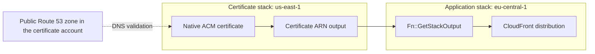

# ACM certificates

`DnsValidatedCertificateV2` creates a DNS-validated public ACM certificate in a chosen AWS region. It uses native CloudFormation resources and can place the certificate in a separate stack, including `us-east-1` for CloudFront applications deployed from another region. Import it from `@open-constructs/aws-cdk/aws-certificatemanager`; the module is maintained and released as part of the Open Constructs Library.

## Requirements

Use Node.js 22 or newer, `aws-cdk-lib` 2.268.0 or newer, and `constructs` 10.8.1 or newer. The library provides JavaScript/TypeScript and Python bindings. Install the JavaScript package with its peers:

```bash
npm install @open-constructs/aws-cdk 'aws-cdk-lib@^2.268.0' 'constructs@^10.8.1'
```

DNS validation requires a publicly delegated Route 53 zone in the certificate account. With no placement inputs, the certificate stays in the containing stack, including an environment-agnostic stack. Explicit `certificateRegion` and separate-stack placement require concrete regions. Separate owners accept concrete hosted-zone IDs or native public zones created inside that owner. Use an existing zone imported by ID or attributes, or an explicit application lookup. The construct does not perform lookups or SDK calls during synthesis.

## CloudFront from another region

CloudFront requires its viewer certificate in [`us-east-1`](https://docs.aws.amazon.com/AmazonCloudFront/latest/DeveloperGuide/cnames-and-https-requirements.html). An explicit owner stack makes certificate lifecycle management straightforward:

```typescript
import { App, Stack } from 'aws-cdk-lib';
import { DnsValidatedCertificateV2 } from '@open-constructs/aws-cdk/aws-certificatemanager';
import { Distribution } from 'aws-cdk-lib/aws-cloudfront';
import { HttpOrigin } from 'aws-cdk-lib/aws-cloudfront-origins';
import { HostedZone } from 'aws-cdk-lib/aws-route53';

const app = new App();
const account = process.env.CDK_DEFAULT_ACCOUNT;
const certificates = new Stack(app, 'Certificates', {
  env: { account, region: 'us-east-1' },
});
const application = new Stack(app, 'Application', {
  env: { account, region: 'eu-central-1' },
});

const zone = HostedZone.fromHostedZoneAttributes(certificates, 'Zone', {
  hostedZoneId: 'Z1234567890',
  zoneName: 'example.com',
});

const certificate = new DnsValidatedCertificateV2(application, 'Certificate', {
  domainName: 'www.example.com',
  hostedZone: zone,
  certificateStack: certificates,
});

new Distribution(application, 'Distribution', {
  certificate,
  domainNames: ['www.example.com'],
  defaultBehavior: { origin: new HttpOrigin('origin.example.com') },
});

app.synth();
```

Replace the example zone ID, names, account environment, and origin with your application's values. Importing a zone does not establish real DNS delegation. CloudFront accepting a tokenized ARN at synthesis does not certify its region, issuance, or eventual deployability. For regional services, omit placement to use the containing stack, or set `certificateRegion` to the service's region. An explicit owner's region is authoritative, including regions outside `us-east-1`.



## Placement and ownership

Omit both placement inputs to create the certificate in the containing stack. Set `certificateRegion` to request a concrete region: a matching region stays local; a different region creates one generated owner per containing-stack address and target region. Different containing stacks receive different generated owners. Separate construct instances always create separate certificates.

Pass `certificateStack` for an explicit owner with its own stack name, synthesizer, tags, permissions boundary, termination protection, or lifecycle. Its region determines the certificate region. It cannot be combined with `certificateRegion`, even with equal values. Distinct owners must match the app/stage, account, and partition. Unmanaged collisions with generated owner IDs are rejected; pass the existing stack explicitly instead. A stable owner ID does not protect a certificate from replacement when its construct is renamed or moved.

For automatic CloudFront placement, request its region explicitly:

```typescript
import { App, Stack, Tags } from 'aws-cdk-lib';
import { DnsValidatedCertificateV2 } from '@open-constructs/aws-cdk/aws-certificatemanager';
import { Distribution } from 'aws-cdk-lib/aws-cloudfront';
import { HttpOrigin } from 'aws-cdk-lib/aws-cloudfront-origins';
import { HostedZone } from 'aws-cdk-lib/aws-route53';

const app = new App();
const application = new Stack(app, 'Application', {
  env: { account: process.env.CDK_DEFAULT_ACCOUNT, region: 'eu-central-1' },
});

const zone = HostedZone.fromHostedZoneAttributes(application, 'Zone', {
  hostedZoneId: 'Z1234567890',
  zoneName: 'example.com',
});

const certificate = new DnsValidatedCertificateV2(application, 'ViewerCertificate', {
  domainName: 'www.example.com',
  hostedZone: zone,
  certificateRegion: 'us-east-1',
});

Tags.of(certificate).add('Service', 'website');
Tags.of(certificate).add('Name', 'operations-name', { priority: 200 });

certificate.certificateResource.addPropertyOverride('CertificateTransparencyLoggingPreference', 'DISABLED');

new Distribution(application, 'Distribution', {
  certificate,
  domainNames: ['www.example.com'],
  defaultBehavior: { origin: new HttpOrigin('origin.example.com') },
});

app.synth();
```

Regional default and explicit owner inference use the same API:

```typescript
import { App, Stack } from 'aws-cdk-lib';
import { DnsValidatedCertificateV2 } from '@open-constructs/aws-cdk/aws-certificatemanager';
import { HostedZone } from 'aws-cdk-lib/aws-route53';

const app = new App();
const account = process.env.CDK_DEFAULT_ACCOUNT;
const application = new Stack(app, 'Application', { env: { account, region: 'eu-central-1' } });
const owner = new Stack(app, 'RegionalOwner', { env: { account, region: 'eu-west-1' } });

const zone = HostedZone.fromHostedZoneId(application, 'Zone', 'Z1234567890');

new DnsValidatedCertificateV2(application, 'Local', { domainName: 'api.example.com', hostedZone: zone });

new DnsValidatedCertificateV2(application, 'Owned', {
  domainName: 'service.example.com',
  hostedZone: zone,
  certificateStack: owner,
});

app.synth();
```

`certificateRegion` and `env.region` describe the native certificate region. `Stack.of(certificate)` and `certificate.stack` describe the wrapper's actual construct-tree stack. `certificateStack` owns the native ACM resource. Nested stacks inherit their parent's environment and lifecycle: a nested consumer can reference a top-level regional owner, and a parent can consume a nested owner's output through CDK's native nested references. Nested owners support consumers only within the same top-level stack tree, including ancestors, siblings, and descendants. Sharing outside that tree fails at synthesis; use a top-level `certificateStack` for external sharing. This boundary follows the actual ARN consumer, regardless of where the wrapper was constructed. A separately configured regional owner must be a top-level stack.

## DNS validation

Specify exactly one of `hostedZone` and `hostedZonesByDomain`. A single zone validates the primary name and SANs. In multi-zone mode, provide an exact entry for every primary/SAN name, with no unused entries. Matching ignores case and one trailing dot; concrete names are emitted in lowercase without that dot. The wildcard prefix is preserved. Duplicate normalized domain names or map keys are rejected. Only the map's own entries count; there is no implicit apex-domain fallback.

```typescript
import { App, Stack } from 'aws-cdk-lib';
import { DnsValidatedCertificateV2 } from '@open-constructs/aws-cdk/aws-certificatemanager';
import { HostedZone } from 'aws-cdk-lib/aws-route53';

const app = new App();
const stack = new Stack(app, 'Certificates', {
  env: { account: process.env.CDK_DEFAULT_ACCOUNT, region: 'us-east-1' },
});

const primaryZone = HostedZone.fromHostedZoneAttributes(stack, 'PrimaryZone', {
  hostedZoneId: 'Z1234567890',
  zoneName: 'example.com',
});
const alternateZone = HostedZone.fromHostedZoneAttributes(stack, 'AlternateZone', {
  hostedZoneId: 'Z0987654321',
  zoneName: 'example.net',
});

new DnsValidatedCertificateV2(stack, 'Certificate', {
  domainName: 'www.example.com',
  subjectAlternativeNames: ['api.example.net'],
  hostedZonesByDomain: {
    'www.example.com': primaryZone,
    'api.example.net': alternateZone,
  },
});

app.synth();
```

In single-zone mode, deployment-time scalar expressions are preserved; names that become concrete during synthesis are normalized consistently, and a created same-stack zone can have a tokenized zone ID. Lazy SAN lists are supported when their length resolves during synthesis; duplicate and authority checks then run against the resolved names. Empty lists, including `omitEmpty: true` and producers returning `undefined`, omit the native SAN property and validate only the primary name. Lists whose length remains unknown until deployment cannot generate the required per-name DNS options and produce a focused synthesis error; use a fixed-length array of string tokens instead. Multi-zone mode requires concrete names and a concrete SAN list. A native public hosted zone created in `certificateStack` retains its local reference. Other unresolved zone IDs remain unsupported across owners; importing a token into the owner does not make its origin local. Tokenized domain names must also be valid in the native owner: use concrete app/context values or owner-defined parameters. Consumer-owned parameters can create a reverse dependency and cycle with the ARN reference; CDK reports that cycle during synthesis. The `/hostedzone/` ID prefix is removed when importing into the owner.

Where the zone name is available, validation checks DNS-label authority for the primary name and SANs. Known private zones and known different accounts are rejected. An arbitrary imported `IHostedZone` cannot prove privacy or account ownership merely from its construct scope; public status, ownership, and actual delegation remain caller preconditions. Apex and wildcard validation can share a record, and public CDK avoids redundant native options for that pair.

## Options, tags, metrics, and escape hatches

Standard options include `subjectAlternativeNames`, `transparencyLoggingEnabled` (enabled by default), `allowExport` (disabled by default), `keyAlgorithm` (RSA 2048 by default), and `certificateName`. Public ACM requests support RSA 2048 and the supported ECDSA P-256/P-384 algorithms; select one compatible with the consuming service. Exportable certificates incur issuance and renewal charges.

The default `Name` tag is the wrapper's construct path truncated to 255 characters. `certificateName` sets that tag; it is not a physical certificate name. Use standard `Tags.of(certificate)` for tags, with ordinary CDK priorities, exclusions, and removals. For a deterministic `Name` override, specify a higher priority such as 200 as shown above. Containing-scope, app, and explicit-owner tags reach the native ACM resource through its tag manager. This proxy does not make arbitrary aspects traverse into a sibling owner.

The default removal policy is `RemovalPolicy.DESTROY`; set `removalPolicy` or call `applyRemovalPolicy()` to change it. `metricDaysToExpiry()` returns `AWS/CertificateManager`'s `DaysToExpiry` metric using the minimum statistic, a one-day period, the certificate ARN dimension, and the certificate region. Metric options can customize the period or label.

`certificateResource` is the public readonly typed `CfnCertificate` in `certificateStack`; `node.defaultChild` points to the same resource. Its property overrides affect that owning template; the pointer does not move the resource into the wrapper's containing stack. Subclasses can override the protected `createCertificateResource(scope, id, props)` factory and access `certificateResource`. The default implementation composes the public ACM `Certificate` construct. Factory props contain eagerly normalized inputs with opaque SAN lists withheld; the constructor applies shared late-name resolution after the factory returns, so an ordinary subclass override retains DNS normalization and validation.

`DnsValidatedCertificateV2.fromCertificateAttributes(scope, id, { certificateArn })` returns ACM's existing `ICertificate` for an existing ARN. It creates no certificate, stack, or validation records, does not validate or adopt the resource, and does not expose V2 placement properties. The imported interface retains public CDK's import behavior. `isDnsValidatedCertificateV2()` identifies OCF-managed V2 constructs across package copies and returns false for ordinary imported certificates.

## Deploying, replacing, and removing certificates

Deploy the owner before the consumer; CDK's synthesized dependency orders stacks that consume the ARN. The construct applies weak cross-stack reference strength to the native certificate producer. A certificate with a top-level owner can be shared by its owner and other stacks: owner-local consumers and outputs retain a direct native `Ref`, while remote consumers use the native output appropriate to their stack. This also applies when the certificate was constructed locally with no placement inputs. Nested owners retain native references within their top-level stack tree and reject consumers outside it. Supported sharing needs no `crossRegionReferences` flag, provider Lambda, custom resource, IAM role, or log group. The application independently chooses its global `@aws-cdk/core:defaultCrossStackReferences` policy; the construct does not change it.

[`Fn::GetStackOutput`](https://docs.aws.amazon.com/AWSCloudFormation/latest/TemplateReference/intrinsic-function-reference-getstackoutput.html) resolves during consumer create/update operations. Changing the owner alone does not refresh a deployed consumer. Weak references avoid a strong export lock but do not permit deleting an in-use certificate. For replacement, create a separately named second certificate, deploy it, switch and deploy the distribution, verify it no longer uses the old certificate, then remove the old certificate. Do not assume replacement of an in-use certificate succeeds in one deployment.

For removal, first detach or replace consumers and deploy those changes. Remove the certificate from its explicitly declared owner and deploy that owner while the stack definition still exists. You can then delete the empty owner stack separately. For generated owners, record the deployed stack name before removing the last construct: disappearance from the cloud assembly does not delete a remote stack. `RemovalPolicy.RETAIN` intentionally leaves the certificate for separate management.

[ACM validation CNAMEs](https://docs.aws.amazon.com/acm/latest/userguide/dns-validation.html) can be reused by other certificates and are not automatically removed by this construct. Retain shared records. Cross-account certificates/DNS writes, external DNS providers, private ACM certificates, and automatic CNAME cleanup are outside this module's scope.

For contributor validation, see the [integration fixture runbook](../../test/aws-certificatemanager/README.md). Report problems in [Open Constructs Library issues](https://github.com/open-constructs/aws-cdk-library/issues).
